# Perl 入学式

### 第 0 回 環境構築編

---

## msys2 環境の構築（前半）

### Windows ユーザ向け msys2 のインストール

---

## msys2 インストール時の推奨環境

- msys2 で Perl の開発環境を構築するためには、約 1GB のストレージ容量を必要とします。

- C ドライブの容量が心配な方は、必要に応じて D ドライブや USB メモリ等にインストールしてください。

- メモリ（RAM）は Windows 自体がストレスなく動く環境であれば特に問題ありません。

- 一部のアンチウイルスソフトで誤検知を確認しています。アンチウイルスソフトは Windows Defender を推奨します。

---

## Windows の 32bit/64bit の判別法

<a href="https://support.microsoft.com/ja-jp/help/15056/windows-32-64-bit-faq" target="_blank">32 ビットと 64 ビットの Windows: よく寄せられる質問</a>内の「コンピューターで実行中の Windows が 32 ビット バージョンであるか 64 ビット バージョンであるかを確認するにはどうすればよいですか?」を参考に判別します。

また、動画も用意しています。
<a href="https://youtu.be/RHM4dC8LzAo" target="_blank">01 Windows アーキテクチャ確認（字幕）</a>

---

## msys2 の入手

### msys2 のインストーラーを用意する

<a href="https://www.msys2.org/" target="_blank">https://www.msys2.org/</a>

環境にあわせて、「msys2-i686-YYYYMMDD.exe」または「msys2-x86_64-YYYYMMDD.exe」を利用します。

- Windows が 64 ビットバージョンの場合：msys2-x86_64-YYYYMMDD.exe

- Windows が 32 ビットバージョンの場合：msys2-i686-YYYYMMDD.exe

うまくダウンロードできない人はサポーターに聞いてください。

<small>ファイル名の i686 や x86_64 はアーキテクチャ名であり、YYYYMMDD は msys2 がリリースされた日付です。</small>

動画も用意しています。
<a href="https://youtu.be/Qtv1eDx5ZTE" target="_blank">02.インストーラーの入手</a>

---

## msys2 のインストール（１）

### ダウンロードした msys2 をインストールする

ダウンロードした`exe`ファイルをダブルクリックして開くと、インストールが始まります。

正常に終わらない場合は、右クリックして「管理者として実行」してください。

「MSYS2 xxbit のセットアップ」と表示されるので、「次へ」を押します。

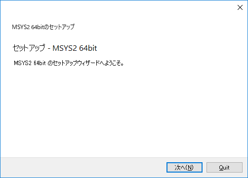<br clear="all">

<br clear="all">

動画も用意しています。
<a href="https://youtu.be/4SGMuO7E250" target="_blank">03.msys2 のインストール</a>

---

## msys2 のインストール（２）

### インストール先フォルダを指定する

デフォルトでは「C:¥msys64」や「C:¥msys32」と表示されます。

変更する必要がなければそのまま「次へ」を押します。

同じフォルダ名が存在する場合はエラーになります。

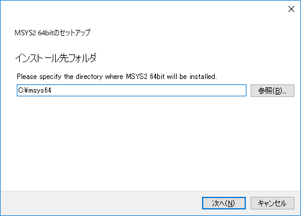

<br clear="all">

---

## msys2 のインストール（３）

### スタートメニューのショートカット名を指定

デフォルトでは「MSYS2 64bit」や「MSYS2 32bit」と表示されます。

任意の名前を指定できますが、変更する必要がなければそのまま「次へ」を押します。

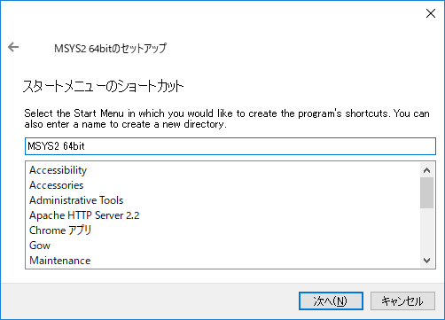

<br clear="all">

---

## msys2 のインストール（４）

### インストールを開始します

ここまで完了すると「MSYS2 64bit のインストール」または「MSYS2 32bit のインストール」と表示され、実際にインストールがはじまります。
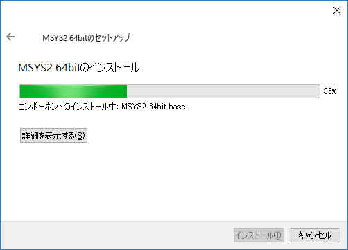

<br clear="all">

---

## msys2 のインストール（５）

### インストールの完了

インストールが完了すると「MSYS2 64bit のウィザードの完了」または「MSYS2 32bit のウィザードの完了」と表示されます。
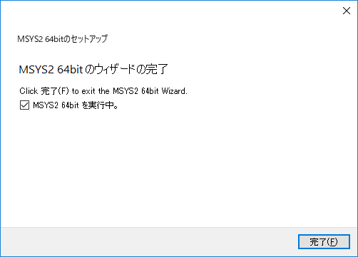

<br clear="all">

「MSYS2 64bit を実行中。」「MSYS2 32bit を実行中。」どちらかが表示されます。チェックボックスはオンにしたまま「完了」をクリックします。

---

## msys2 のインストール（６）

### msys2 の起動

インストーラーで「完了」をクリックすると msys2 が起動します。

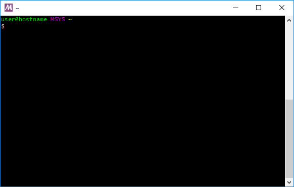

<br clear="all">

この「黒い窓」「黒い画面」のことを「**ターミナル**」「**端末**」と言います。

---

## msys2 のインストール（7）

### msys2 の起動（2 回目以降）

次回以降は次のどちらかの方法で起動します。

- スタートメニューから「MSYS2 MSYS」を選択して起動

- インストールしたディレクトリ内の「msys2.exe」を起動

- タスクバーの検索メニューに msys2 と入力し、検索候補の中から「MSYS2 MSYS」を選択して起動

---

## msys2 のインストール（8）

### msys2 を起動したときに

次のようなウィンドウが表示される場合があります。

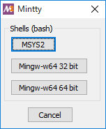

<br clear="all">

この場合は、「MSYS2」を選択します。

<small>Perl を利用する場合は「MSYS2」が適しているため</small>

---

## msys2 環境の構築（後半）

### Windows ユーザ向け Perl のインストール

---

## msys2 のセットアップ（１）

### パッケージマネージャを利用する

**パッケージマネージャ**はソフトウェアを管理するためのソフトウェアです。

利用するソフトウェアを最新で安全な状態に保つためには、パッケージマネージャが管理している情報の更新が不可欠です。

msys2 では <ruby>pacman<rt>パックマン</rt></ruby> というパッケージマネージャを利用します。

---

## msys2 のセットアップ（２）

### コマンド入力時の注意点

これ以降、下記のように入力コマンドを示す記載が頻繁に例示されます。

```bash
# msys2 とデータベース情報のアップデート
$ pacman -Syu
```

「<ruby>`#`<rt>シャープ</rt></ruby>」から始まる行はコメントです。**入力は不要**です。

「<ruby>`$`<rt>ダラー</rt></ruby>」はプロンプトです。コマンドが入力ができる状態であることを意味します。

上記は `pacman -Syu`と入力し、行末で enter キー、またはリターンキーを押すことを意味します。

Perl のインストールまで動画も用意しています。
<a href="https://youtu.be/x_Ah02H15AE" target="_blank">04.Perl のインストール</a>

---

## msys2 のセットアップ（３）

### パッケージマネージャを利用する

次のコマンドを実行して pacman が管理しているデータベースを更新しましょう。

大文字・小文字にも意味があるので、書いてある通りに入力してください。

```bash
# msys2 とデータベース情報のアップデート
$ pacman -Syu
```

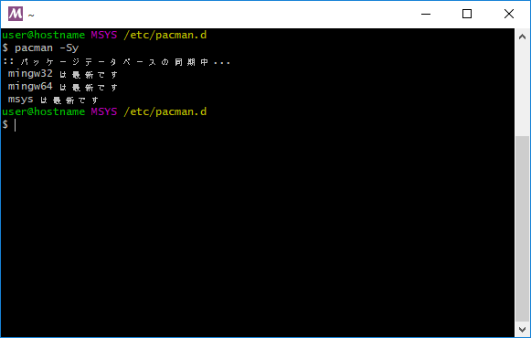

<br clear="all">

アップデートが成功すると、ターミナルは自動で閉じられます。

---

## msys2 のセットアップ（４）

### msys2 に perl をインストールする

pacman を利用して、さまざまなソフトウェアをインストールすることができます。

さっそく perl をインストールしてみましょう。

---

## msys2 のセットアップ（５）

### msys2 に perl をインストールする

次のコマンドを実行して perl を利用するために必要なソフトウェアをインストールします。
すべて完了するまで少し時間がかかります。

```bash
# perlと必要なソフトウェアのインストール
$ yes "" | pacman -Sy perl perl-CPAN msys2-devel make libcrypt-devel openssl perl-Net-SSLeay perl-IO-Socket-SSL
```

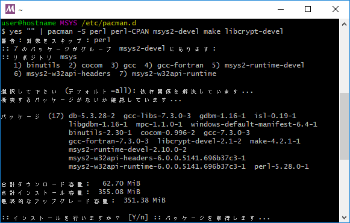

<br clear="all">

---

## perl の動作確認

### Windows ユーザ向け msys2 版

---

## perl の動作確認（１）

### perl が動作することを確認しましょう

次のコマンドを実行して perl のバージョンを確認します。

`This is perl 5, version xx, ...` などと表示されれば、インストールは成功しています。

```bash
# perlのバージョンを確認する
$ perl -v
```

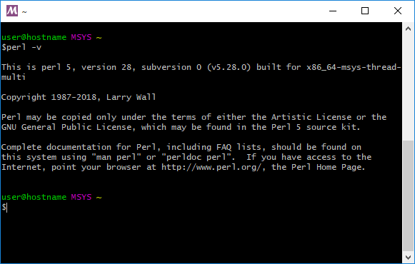

<br clear="all">

---

## perl の動作確認（２）

### cpan が動作することを確認しましょう

次のコマンドを実行して perl で利用する cpan が動作することを確認します。

```bash
# cpanの動作状況を確認する。入力を求められるので yes と入力してエンターキーを押す
$ cpan JSON::XS

# インストールが完了したら以下を実行。正常な場合は何も出力されません。
$ perl -MJSON::XS -e 1
```

---

## perl の動作確認（3）

### すでに別の Perl をインストールしている場合

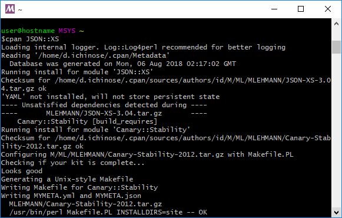

<br clear="all">

既に別の Perl をインストールしている場合、環境変数 PERL5LIB の影響を受ける場合があります。

その場合は「PERL5LIB=」などを実行し、PERL5LIB を空にしてから実行してください。

---

## msys2 の基本

### Windows ユーザ向け

---

## msys2 の基本 (１)

msys2 に限らず、ほとんど全てのソフトウェアは様々な理由でアップデートされます。

msys2 は pacman 利用することで、インストールされているソフトウェアを最新にすることができます。定期的に実行しましょう。

以下のコマンドを実行すると msys2 にインストールされているソフトウェアがアップデートされます。

ただし、アップデートは時間がかかるため、**ここでは実行せずに家で実行する** ようにしてください。

```bash
# ソフトウェアのアップデート
$ pacman -Syu
```

更新内容によっては、全ての更新が 1 度で終了せずに msys2 を 1 度閉じてから、再度起動し、もう一度上記のコマンドを実行する必要があるので覚えておきましょう。

---

## msys2 の基本 (２)

パッケージマネージャを利用したパッケージの検索とインストールの方法を紹介します。

もしもインストールが失敗する場合は、先ほど紹介したアップデートを実行してみましょう。

```bash
# パッケージの検索（perl-YAMLを検索する）
$ pacman -Ss perl-YAML

# パッケージ情報を確認（perl-YAMLを確認する）
$ pacman -Si perl-YAML

# パッケージのインストール（perl-YAMLをインストールする）
$ pacman -S perl-YAML
```

---

## msys2 の基本 (３)

msys2 では windows のコマンドも実行できます。

ただし、ターミナルの文字コードの問題で文字化けが発生する場合があります。

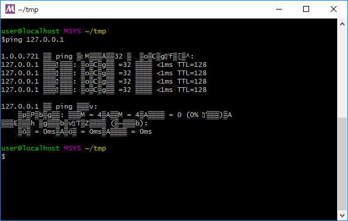

<br clear="all">

---

## msys2 の基本 (４)

msys2 に用意されている `start` コマンドは、アプリケーションを実行するためのコマンドです。

これは非常に便利な機能です。試しに以下のコマンドを実行してみてください。

```bash
# startの後にスペースと.（ドット）を入力して実行
$ start .
```

現在のディレクトリで <ruby>Explorer<rt>エクスプローラー</rt></ruby> が起動します。

---

## msys2 の基本 (５)

先ほどの start コマンドで開いた Explorer のディレクトリパスを見てみましょう。

次のようなパスになっているはずです。

```bash
# XXはアーキテクチャによって変わります。
# <User>の部分は皆さんが利用しているユーザー名です。
C:\msysXX\home\<User>
```

msys2 は標準で `C:\msysXX\` 配下に様々なディレクトリを作成します。

そのため、ファイルの編集には Windows のアプリケーションをそのまま利用することができます。

大切なことなので、必ず覚えておいてください。

---

## これで perl のインストールは完了です。お疲れ様でした!
