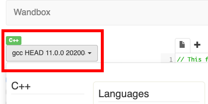
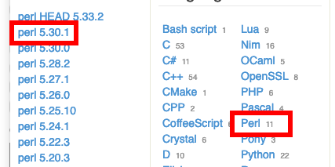
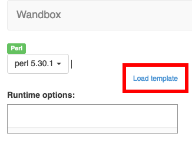
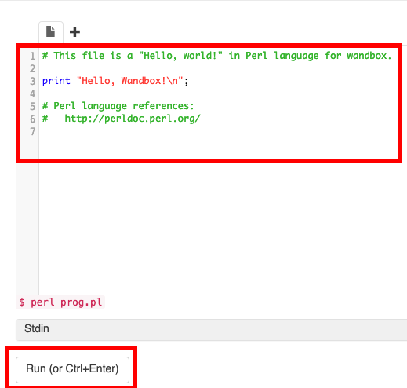
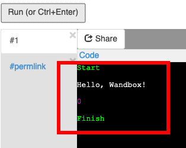

# Perl 入学式

## 第 1 回 学習環境構築 編

---

## 諸注意

- Perl 入学式 online 版の講義は、Youtube Live にてスライドの表示と講師の説明を配信します。

- 講義では実際に手を動かしてプログラミングしてもらいます。

---

## 諸注意

- 講義中の疑問点は Discord で質問して下さい。サポーターが適宜回答やアドバイスを行える様にスタンバイしています。

- うまくプログラムが動かない、分からない時は Discord #雑談部屋 でサポーターにヘルプを要請してください。Discord のテキスト及び音声チャットにて個別にサポートします。

- <a href="https://discord.com/">Discord | 会話や交流が楽しめるプラットフォーム</a>

---

## 本日の内容

- Perl 入学式の学習環境について
- Perl 入学式について
- Perl という言語について
- Perl をより深く学ぶ方法と色々な Perl コミュニティについて
- Hello, World

---

## Perl 入学式の学習環境について

---

## Wandbox

Perl 入学式 online 版では、基本的に Web ブラウザ版の環境で学習します。

<a href="https://wandbox.org">Wandbox</a> を利用します。

1. ブラウザで Wandbox のページを開きます。

1. 左上に `gcc HEAD 11.0.0 20200` というプルダウンメニューがありますのでクリックします。



---

## Wandbox

1. メニューの右側から Perl を選択します。

1. 左側の Perl のバージョンから `Perl 5.30.1` を選択します。



---

## Wandbox

`Load template` のリンクをクリックします。



---

## Wandbox

この時点で、Perl のプログラムが右側のテキストエリアに表示されています。下にある `Run (or Ctrl+Enter)` をクリックします。



---

## Wandbox

下にプログラムの実行結果が表示されます。このようにして学習を進めていきます。



---

## 手元の PC に環境構築する場合

すでに手元の PC に環境がある方は、その環境を利用してください。

PC への環境構築の方法は、<a href="https://github.com/perl-entrance-org/workshop-2019/blob/master/1st/part1.md">2019 年度資料の「第 1 回　第 1 部」</a>にて公開しています。

---

## Perl 入学式の学習環境について

みなさん、Perl の実行環境は準備できましたでしょうか？

出来た方は、Discord のテキストチャットで「出来た！」とリアクションしてみてください。

よくわからない方は Discord のテキストチャットにて、サポーターにヘルプを求めてください。

---

# Perl 入学式について

---

## Perl 入学式とは

2012 年 1 月に大阪で誕生した、プログラミング未経験者〜初心者向けの Perl 勉強会です。

- 2013 年度 : 東京開講
- 2014 年度 : 福岡開講
- 2015 年度 : 沖縄開講
- 2017 年度 : 札幌開講
- 2019 年度 : 千歳開講

<small>講師の都合に合わせて休講しているところもあります。</small>

---

## Perl 入学式とは

参加費は無料です。受講者の負担が極力少ない形で行われています。

現在のカリキュラムは全 4 〜 5 回です。

---

## Perl 入学式の使い方

- プログラミング、ちょっと興味があるから始めてみたいな、という人。

- 今流行のウェブアプリケーションを作ってみたいものの、基礎から勉強したい人。

- 他の言語を使っているけど、ちょっと Perl も使ってみたいと思った人。

- 仕事や研究で Perl を使い始めたけど、ちょっと自信がないので勉強したい人。

皆さんの学びたい、作りたいといった気持ち、目標をサポートします！

---

## オンラインでのサポート

- <a href="http://perl-entrance.org/" target="_blank">Perl 入学式の公式ページ</a>

- <a href="https://twitter.com/Perl_Entrance">Twitter アカウント [@Perl_Entrance]</a>

  - 公式ページや<ruby>Tiwtter<rt>ツイッター</rt></ruby>アカウントでは、開催日程などがアナウンスされます。

- <a href="https://twitter.com/hashtag/Perl%E5%85%A5%E5%AD%A6%E5%BC%8F?src=hash" target="_blank">Twitter ハッシュタグ [#Perl 入学式]</a>
  - 運営側がウォッチしているので、なにか疑問があればこれをつけて気軽に質問してみましょう。

---

## オンラインでのサポート

- Discord Perl 入学式チャンネル

  - <a href="https://discord.com/channels/741610576609935430/741610901303721998"><ruby>Discord<rt>ディスコード</rt></ruby></a> というチャットツールを使って、サポーターや参加者とのチャットが出来ます。
  - こちらでも気軽に質問や雑談をしてみましょう。

- <a href="https://github.com/perl-entrance-org" target="_blank">GitHub の Perl 入学式アカウント</a>
  - <ruby>GitHub<rt>ギットハブ</rt></ruby>というコードの集積サイトに講義で使われた資料、コードなどがあります。

---

# Perl という言語について

---

## Perl って何?

1987 年、<ruby>Larry Wall<rt>ラリー ウォール</rt></ruby>(右写真)が開発したプログラミング言語です。


<ruby>Ruby<rt>ルビー</rt></ruby>、<ruby>Python<rt>パイソン</rt></ruby>、<ruby>PHP<rt>ピーエイチピー</rt></ruby>と並ぶ軽量言語(<ruby>Lightweight Language<rt>ライトウェイト ランゲージ</rt></ruby>)と呼ばれるカテゴリのプログラミング言語の 1 つです。

---

## Perl の登場

Perl は C 言語や<ruby>sed<rt>セド</rt></ruby>、<ruby>awk<rt>オーク</rt></ruby>の影響を受けた動的型付け言語です。

<small>先頭大文字「Perl」は言語そのもの、先頭小文字「perl」はその処理系を示します。</small>

Perl は後に開発された Ruby(1995 年)や PHP(1995 年)に影響を与えました。

- <a href="https://www.levenez.com/lang/">Computer Languages History</a>

- <a href="https://exploring-data.com/vis/programming-languages-influence-network/#Perl">Programming Languages Influence Network | Exploring Data</a>

---

## Perl の特徴

<a href="https://ja.wikipedia.org/wiki/Perl" target="_blank">Wikipedia の記事</a>から重要なものだけ引用します。

- 強力な文字列処理。<ruby>正規表現<rt>せいきひょうげん</rt></ruby>をサポート

- 日本語をはじめとした世界中の言語を処理可能

- 自由度の高い文法。簡潔にプログラムを記述可能

---

## Perl の特徴

- 高い後方互換性

- 数多くのオペレーティングシステムで利用可能

- プログラムの実行には事前コンパイルは不要

- 有志によって開発された豊富なモジュール

---

## TMTOWTDI

Perl のスローガン、「ティムトゥーディー」と読みます。

" There's more than one way to do it. " の頭文字をとったもの。

意味は「やり方はひとつじゃない」。

---

## TMTOWTDI

Larry は「プログラミング言語は、いろんな対象をシンプルに記述する為に、ある程度複雑でなければならない」と信じています。

Perl は同じ処理を、様々な書き方で表すことができます。

これについては、きっとこれからの Perl 入学式のカリキュラムの中で実際に体験することになります。

---

## 高い後方互換性

Perl のバージョンアップによって新機能の追加や、セキュリティ対策が行われます。

バージョンアップによって昔のスクリプトが動かなくなる、ということは**ほとんど**ありません。

基本的な処理については、高いレベルで後方互換性が維持されています。

---

## 豊富なモジュール

Perl には**モジュール**という、特定の処理に特化した追加プログラムが豊富に用意されています。

<ruby>CPAN<rt>シーパン</rt></ruby>と呼ばれるアーカイブに、全世界の Perl <ruby>Monger<rt>モンガー</rt></ruby>がモジュールを投稿しています。

<small>Perl Monger ... Perl 使い、Perl を得意とするエンジニアのこと。Ruby における<ruby>Rubyist<rt>ルビースト</rt></ruby>、Python における<ruby>Pythonista<rt>パイソニスタ</rt></ruby>と同義です。</small>

---

## 豊富なモジュール

- <ruby>Encode<rt>エンコード</rt></ruby> ... 文字列のエンコードを処理するモジュール。

- Net::Twitter ... Twitter の API を操作するモジュール。

- DBD::<ruby>SQLite<rt>エスキューライト</rt></ruby> ... Perl から、SQLite というデータベースを操作するモジュール。

---

## Perl5 のバージョンの歴史

- Perl 4 以前は前史として、既に周囲に環境が存在しないと思って良いです。

- 1994 年、Perl5 (Perl 5.000) が登場しました。

- 2000 年、Perl 5.6 が登場。この頃からインターネットやウェブというものが徐々に一般に普及していきます。

- 2002 年、Perl 5.8 が登場。国際化対応や今につながる様々な機能が搭載されます。5.8 時代が長かったため、多くのサービスで長きにわたって使われました。

参考: <a href="https://speakerdeck.com/anatofuz/regasiperlbirudo-xian-dai-nisu-ruperl-1-2-dot-0toperl6" target="_blank">レガシー Perl ビルド ~現代に蘇る Perl[1..5].0 と Perl6~</a>

---

## Perl5.8 以降のバージョンの歴史

- 2007 年 : Perl 5.10 が登場。 後方互換性を維持した構文拡張等。
- 2016 年 : Perl 5.24 が登場。
- 2017 年 : Perl 5.26 が登場。
- 2018 年 : Perl 5.28 が登場。
- 2019 年 : Perl 5.30 が登場。
- 2020 年 : Perl 5.32 が登場。 現在の最新の安定版です。

---

## Perl5 の安定板と開発版

- 5.(偶数) が安定版、 5.(奇数) が開発版です。

- 5.(奇数) の開発版をあえてインストールする必要はありません。5.(偶数) の安定版をインストールしましょう。

- 基本的に最新版の一つ手前の安定版までがサポート対象です。

---

## Perl5 の安定板と開発版

- 過去のバージョンの Perl が生き残っている現場も多いですが、今なら Perl 5.10 以降だけを考えれば良いです。

- Perl 5.10 以降から 5.30 まで、Perl 初学者にとって大きな違いはあまりありません。

---

## 余談: <ruby>Raku<rt>ラク</rt></ruby>（旧称 Perl6）について

- Perl 5 とは別に、Perl 6 も開発されています。

- Perl 5 と Perl 6 では互換性を考慮していません。

- 当初は Perl5 の後継となるはずでしたが、後に「Perl5 とは別に開発を進める」と公式に発表されました。

- これは Perl5 のバージョン間での互換性が最大限に保たれていることの裏返しでもあります。

---

## 余談: <ruby>Raku<rt>ラク</rt></ruby>（旧称 Perl6）について

- 2019 年 10 月、Perl6 は Raku と改名しました。順次、名称の変更作業が行われています。

参考: <a href="https://raku.org/" target="_blank">The Raku Programming Language</a>

---

## Perl のコミュニティ

世界各地に Perl Monger(PM)のコミュニティが存在します。

地域の Perl Mongrer コミュニティは、(地名).pm を名乗ることが多いです。

日本でも、多くのコミュニティ、勉強会が開催されています。

---

## 地域コミュニティ

- <a href="pm.org" target="_blank">pm.org</a> に登録されている、公認のコミュニティ。

  - Hokkaido.pm, Kushiro.pm, Sendai.pm, Niigata.pm, Tokyo.pm, Shibuya.pm, Yokohama.pm, Kamakura.pm, Gotanda.pm, Nagoya.pm, Kansai.pm, Kyoto.pm, Fukuoka.pm, Okinawa.pm

- 非公認のコミュニティ

  - Hachioji.pm ...

- 勉強会/イベント

  - Hokkaido.pm Casual, Perl Casual, Perl 入学式, よなべ Perl...

---

## YAPC::Japan

<ruby>YAPC<rt>ヤプシー</rt></ruby> ... Yet Another Perl Conference

YAPC::Japan は日本の都市で年度内に 1〜2 度行われる、日本最大規模の Perl の祭典です。

2006 年から 2015 年まで続いた YAPC::Asia の後継イベントです。

---

## YAPC::Japan

- 2016 年 12 月 札幌 <a href="https://yapcjapan.org/2016hokkaido/" target="_blank">YAPC::Hokkaido 2016 SAPPORO</a>

- 2017 年 7 月 博多 <a href="https://yapcjapan.org/2016hokkaido/" target="_blank">YAPC::HAKATA</a>

- 2018 年 3 月 大阪 <a href="https://yapcjapan.org/2018okinawa/" target="\_blank">YAPC::Okinawa 2018 ONNASON</a>

- 2019 年 1 月 東京 <a href="https://yapcjapan.org/2019tokyo/" target="_blank">YAPC::Tokyo 2019</a>

- 2019 年 11 月 名古屋 <a href="https://yapcjapan.connpass.com/event/146727/" target="_blank">YAPC::Nagoya::Tiny 2019</a>

---

## YAPC::Japan

2020 年は京都での開催を予定していましたが、新型コロナウイルス感染拡大防止の為に開催見送り(延期時期未定)となりました。

参考：<a href="https://yapcjapan.org/2020kyoto/" target="_blank">YAPC::Kyoto 2020 開催見送りについて</a>

---

## Perl と CGI

一時期、「Perl で Web サービスを作るなら<ruby>CGI<rt>シージーアイ</rt></ruby>」という時代がありましたが、今はそうではありません。

最近は、<ruby>PSGI<rt>ピーエスジーアイ</rt></ruby>(Perl web Server Gateway Interface)という仕様に対応した<ruby>WAF<rt>ワフ</rt></ruby> (Web Application Framework)を使っての開発が増えています。

---

## Perl と WAF

2020 年現在、Perl の代表的かつ新規採用されやすい WAF としては、<ruby>Mojolicious<rt>モジョリシャス</rt></ruby> や <ruby>Amon2<rt>アモンツー</rt></ruby> などがあります。

Perl 入学式は「モダンな Perl を教える」という方針なので、CGI については触れません。

---

# より深く学ぶには？

---

## 勉強会への参加

日本中の Perl コミュニティが、定期的/不定期に勉強会を開催しています。

Q. 難しい内容かもしれないので不安...

A. 参加するだけなら怖くありません。参加費も無料、もしくは会場費の割勘程度です。

---

## 勉強会への参加

こんな世界もあるんだ〜、程度に聴講すると、数年後にふと繋がることもあります。

懇親会に参加して盛り上がると、さらに業界や Perl 界隈の裏話が聴けたりも！？

---

## 検索 vs 書籍

最近は検索する(ググる)ことで解決することも多いです。

しかし、書籍を通読することで、体系だった知識を身につけることができます。

ネットの情報は玉石混交、一方で書籍の場合は情報の陳腐化があり、一長一短と言えます。

---

## 検索 vs 書籍

最初は誰しも「記号」が分からないので、ググるにも手がかりが無い場合、ドキュメント(<ruby><a href="https://perldoc.perl.org/" target="_blank">perldoc</a><rt>パールドック</rt></ruby> / <a href="https://perldoc.jp/" target="_blank">perldoc.jp</a>)を活用しましょう。

---

## オススメの書籍

- 「<a href="https://www.oreilly.co.jp/books/4873110963/" target="_blank">プログラミング Perl</a>」(通称: ラクダ本)。プログラミング未経験の初心者にはハードルが高く、時期が来るまで買うのを待っても良いかも？

- 「<a href="https://www.oreilly.co.jp/books/9784873118246/" target="_blank">初めての Perl</a>」(通称: リャマ本)。若干プログラミング初心者向け、オライリーの文体に慣れていないと多少厳しいかも。

- 「<a href="https://www.wgn.co.jp/store/dat/3227/" target="_blank">CPAN モジュールガイド</a>」CPAN モジュール（後述）のガイド本。Perl の可能性を知ることができる良書。

---

## オススメの書籍

- 「<a href="https://booth.pm/ja/items/260345" target="_blank">雅な Perl</a>」2015 年に第 3 版刊行。同人誌、とはいえ初心者向けという意味ではかなり秀逸な解説をしています。

- 「<a href="https://gihyo.jp/book/2012/978-4-7741-5025-3" target="_blank">もっと自在にサーバを使い倒す 業務に役立つ Perl</a>」サーバーのログ加工を中心に、Perl の実用例を学べる本です。

様々な書籍がたくさんありますが、割愛します。

---

# Hello, world!

---

## 最初のプログラム

プログラム言語の学習において、最初に解説されるのは「Hello, world! と表示するプログラム」であることが多いです。

早速、Hello, world! を表示する Perl プログラムに挑戦してみましょう。

これはターミナル上(Wandbox の画面下部には、ターミナル風の結果出力部分があります。便宜上この部分の事を以下 'ターミナル' と言います)に `Hello, world!` という文字列を表示するプログラムです。

---

## Hello, World!(hello.pl)

```perl
print "Hello, world!\n";
```

Wandbox の画面上部にある入力欄に上記の文字を入力します。

- `print`は、ターミナルに文字を出力する命令です。

- <ruby>`\n`<rt>バックスラッシュ エヌ</rt></ruby>は改行を意味します。

- Mac の日本語キーボードの場合、`\`は Option + `￥`キーで入力できます。

- 文の最後にはセミコロン(`;`)を付けましょう。文の区切りという意味です。

---

## スクリプトの実行

Wandbox の入力欄の下にある [Run (or Ctrl+Enter)] ボタンを押します。

入力欄の下にあるターミナルに `Hello, world!` と表示されていれば成功です。

[hello.pl](https://wandbox.org/permlink/noU3msxlbzeUY4OO)

---

## 練習問題 (1)

print 命令を複数個使って、Perl 入学式と YAPC の情報を表示するスクリプト`yapc.pl`を書いてみましょう。

- 「この勉強会の名前」、「今日の日付」、「会場名」、「前回の YAPC の場所」を表示してください。

- print 命令を複数書く場合にはセミコロンで文を区切りましょう。

  - セミコロンの後に改行を入れて複数の行にして読みやすくするのが通常です。

  - プログラムは上から順に実行されます。

---

## 練習問題 (2)

```bash
print 5-2;
print "\n";
```

このスクリプトを実行すると、ターミナルに`3`が表示されます。

では、上記のスクリプトを参考にして、2020 から Perl1.0 のリリース年の西暦を引き算して、Perl の満年齢を表示してみましょう。

<small>Perl1.0 のリリース年は 1987 年です (Wikipedia より)</small>

---

# おまじない

---

## おまじない

```perl
#!/usr/bin/env perl
use strict;
use warnings;
```

プログラムには、問答無用で書いておく「おまじない」ともいうべきものがあります。Perl は上記の 3 行が「おまじない」となります。

---

## おまじない

- `#!/usr/bin/env perl` ... <ruby>shebang<rt>シバン</rt></ruby>と呼ばれるもので、このスクリプトが perl で動くことを明示します

- `use strict` ... 厳密な書式で書くことを強制し、未定義の変数を警告する

- `use warnings` ... 望ましくない記述を警告する

以下、この資料のサンプルコードでは「お約束」を省略します。**書かれているもの**として扱ってください。

---

## 練習問題 (hello_perl.pl)

先程の冒頭の 3 行のおまじないを加えた上で、`Hello, Perl`という文字列を出力する`hello_perl.pl`を作成しよう

- ヒント: 文字列はダブルクォーテーション `"` で囲む

- ヒント: 文字列を出力する関数は `print`

---

## お疲れ様でした!

長い時間、Perl 入学式第 1 回お疲れ様でした！

これでみなさんも PerlMonger です。

是非 Perl 入学式の Discord #雑談部屋 でサポーターや参加者の皆さんと交流しましょう。

不明点も Discord #雑談部屋 で是非質問してください。

第 2 回以降の参加もお待ちしております!

---

## 次回予告

- スカラー変数

- 四則演算

- 標準入力

- 条件分岐「if 文, else 文」

- 論理演算子「&&（かつ）, ||（または）」

- スカラー変数の集合,「配列」

- くりかえし「for 文」
