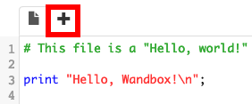
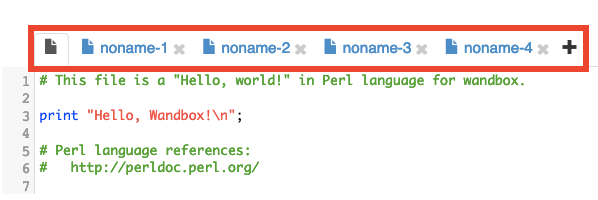
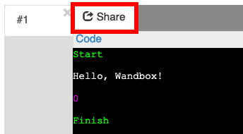

# Perl 入学式

## 第 1 回 学習環境構築 編

---

## 諸注意

- Perl 入学式 online 版の講義は、Youtube Live にてスライドの表示と講師の説明を配信します。

- 講義では実際に手を動かしてプログラミングしてもらいます。

---

## 諸注意

- 講義中の疑問点は Discord で質問して下さい。サポーターが適宜回答やアドバイスを行える様にスタンバイしています。

- うまくプログラムが動かない、分からない時は Discord #雑談部屋 でサポーターにヘルプを要請してください。Discord のテキスト及び音声チャットにて個別にサポートします。

- <a href="https://discord.com/">Discord | 会話や交流が楽しめるプラットフォーム</a>

---

## 本日の内容

- Perl 入学式の学習環境について
- Perl 入学式について
- Perl という言語について
- Perl をより深く学ぶ方法と色々な Perl コミュニティについて
- Hello, World

---

## Perl 入学式の学習環境について

Perl 入学式 online 版では、以下のサービス・ツールを利用して学習を行っていきます。

- 動画の中継：Youtube Live

- Perl 実行環境：<a href="https://wandbox.org"><ruby>Wandbox<rt>ワンドボックス</rt></ruby></a>

- コミュニケーション：<a href="https://discord.com/channels/741610576609935430/741610901303721998"><ruby>Discord<rt>ディスコード</rt></ruby></a>

- スライド共有ツール（仮）：<a href="https://appslideshare.tugougaii.site/">appslideshare</a>

---

## Perl 入学式の学習環境について

４つのサービス・ツールを利用しますが、以下のような構成をお勧めします。

- スマホ・タブレットで Youtube Live を視聴

- PC で スライド共有ツール ・ Wandbox ・ ディスコード を開く

  - 仮想デスクトップ機能・マルチディスプレイなどを用いて、各ツールを切り替える

---

## Wandbox

Perl 実行環境として利用する Wandbox の利用方法です。

1. ブラウザで Wandbox のページを開きます。

1. 左上に `gcc HEAD 11.0.0 20200` というプルダウンメニューがありますのでクリックします。


---

## Wandbox

1. メニューの右側から Perl を選択します。

1. 左側の Perl のバージョンから `Perl 5.30.1` を選択します。


---

## Wandbox

`Load template` のリンクをクリックします。


---

## Wandbox


この時点で、Perl のプログラムが右側のテキストエリアに表示されています。このテキストエリアをエディタと呼びます。

下にある `Run (or Ctrl+Enter)` をクリックします。


---

## Wandbox

下にプログラムの実行結果が表示されます。この黒い部分をターミナルと呼びます。

このようにエディタで入力を行い、ターミナルで実行結果を確認しながら学習を進めていきます。


---

## Wandbox

エディタ部は `+` でタブを増やすことができます。

ただし、`Run (or Ctrl+Enter)` で実行されるのは一番左端のタブのみとなります。





---

## Wandbox

Wandbox で書いたコードを共有することもできます。

共有すると URL が発行されます。コードの確認を依頼する際にとても便利な機能です。

共有すると URL に紐づいてコードがインターネット上に残ります。気をつけてください。



---

## 手元の PC で Perl 実行環境がある場合・または構築する場合

すでに手元の PC に環境がある方は、その環境を利用してください。

PC への環境構築の方法は、<a href="https://github.com/perl-entrance-org/workshop-2019/blob/master/1st/part1.md">2019 年度資料の「第 1 回　第 1 部」</a>にて公開しています。

---

## Perl 入学式の学習環境について

みなさん、Perl の実行環境は準備できましたでしょうか？

出来た方は、Discord のテキストチャットで「出来た！」とリアクションしてみてください。

よくわからない方は Discord のテキストチャットにて、サポーターにヘルプを求めてください。

---

## 休憩 ＆ 質問 ＆ 雑談 タイム（５ 〜 10 分）

---

# Perl 入学式について

---

## Perl 入学式とは

2012 年 1 月に大阪で誕生した、プログラミング未経験者〜初心者向けの Perl 勉強会です。

- 2013 年度 : 東京開講
- 2014 年度 : 福岡開講
- 2015 年度 : 沖縄開講
- 2017 年度 : 札幌開講
- 2019 年度 : 千歳開講

<small>講師の都合に合わせて休講しているところもあります。</small>

---

## Perl 入学式とは

参加費は無料です。受講者の負担が極力少ない形で行われています。

現在のカリキュラムは全 4 〜 5 回を予定しています。

---

## Perl 入学式の使い方

- プログラミング、ちょっと興味があるから始めてみたいな、という人。

- ウェブアプリケーションを作ってみたいもの、基礎から勉強したい人。

- 他の言語を使っているけど、Perl も使ってみたいと思った人。

- 仕事や研究で Perl を使い始めたけど、自信がないので勉強したい人。

皆さんの学びたい、作りたいといった気持ち、目標をサポートします！

---

## オンラインでのサポート

- <a href="http://perl-entrance.org/" target="_blank">Perl 入学式の公式ページ</a>

- <a href="https://twitter.com/Perl_Entrance">Twitter アカウント [@Perl_Entrance]</a>

  - 公式ページや Tiwtter アカウントでは、開催日程などがアナウンスされます。

- <a href="https://twitter.com/hashtag/Perl%E5%85%A5%E5%AD%A6%E5%BC%8F?src=hash" target="_blank">Twitter ハッシュタグ [#Perl 入学式]</a>
  - 運営側がウォッチしているので、なにか疑問があればこれをつけて気軽に質問してみましょう。

---

## オンラインでのサポート

- Discord Perl 入学式チャンネル

  - <a href="https://discord.com/channels/741610576609935430/741610901303721998"><ruby>Discord<rt>ディスコード</rt></ruby></a> というチャットツールを使って、サポーターや参加者とのチャットが出来ます。
  - こちらでも気軽に質問や雑談をしてみましょう。

- <a href="https://github.com/perl-entrance-org" target="_blank">GitHub の Perl 入学式アカウント</a>
  - <ruby>GitHub<rt>ギットハブ</rt></ruby>というコードの集積サイトに講義で使われた資料、コードなどがあります。

---

# Perl という言語について

---

## Perl って何?

1987 年、<ruby>Larry Wall<rt>ラリー ウォール</rt></ruby>(右写真)が開発したプログラミング言語です。


<ruby>Ruby<rt>ルビー</rt></ruby>、<ruby>Python<rt>パイソン</rt></ruby>、<ruby>PHP<rt>ピーエイチピー</rt></ruby>と並ぶ軽量言語(<ruby>Lightweight Language<rt>ライトウェイト ランゲージ</rt></ruby>)と呼ばれるカテゴリのプログラミング言語の 1 つです。

---

## Perl の登場

Perl は C 言語や<ruby>sed<rt>セド</rt></ruby>、<ruby>awk<rt>オーク</rt></ruby>の影響を受けた動的型付け言語です。

<small>先頭大文字「Perl」は言語そのもの、先頭小文字「perl」はその処理系を示します。</small>

Perl は後に開発された Ruby(1995 年)や PHP(1995 年)に影響を与えました。

- <a href="https://www.levenez.com/lang/">Computer Languages History</a>

- <a href="https://exploring-data.com/vis/programming-languages-influence-network/#Perl">Programming Languages Influence Network | Exploring Data</a>

---

## Perl の特徴

<a href="https://ja.wikipedia.org/wiki/Perl" target="_blank">Wikipedia の記事</a>から重要なものだけ引用します。

- 強力な文字列処理。<ruby>正規表現<rt>せいきひょうげん</rt></ruby>をサポート

- 日本語をはじめとした世界中の言語を処理可能

- 自由度の高い文法。簡潔にプログラムを記述可能

---

## Perl の特徴

- 高い後方互換性

- 数多くのオペレーティングシステムで利用可能

- プログラムの実行には事前コンパイルは不要

- 有志によって開発された豊富なモジュール

---

## 高い後方互換性

Perl のバージョンアップによって新機能の追加や、セキュリティ対策が行われます。

バージョンアップによって昔のスクリプトが動かなくなる、ということは**ほとんど**ありません。

基本的な処理については、高いレベルで後方互換性が維持されています。

---

## 検索 vs 書籍

最初は誰しも「記号」が分からないので、ググるにも手がかりが無い場合、ドキュメント(<ruby><a href="https://perldoc.perl.org/" target="_blank">perldoc</a><rt>パールドック</rt></ruby> / <a href="https://perldoc.jp/" target="_blank">perldoc.jp</a>)を活用しましょう。

---

# Hello, world!

---

## 最初のプログラム

プログラム言語の学習において、最初に解説されるのは「Hello, world! と表示するプログラム」であることが多いです。

早速、Hello, world! を表示する Perl プログラムに挑戦してみましょう。

---

## Hello, World!(hello.pl)

```perl
print "Hello, world!\n";
```

Wandbox の画面上部にあるエディタ（入力欄）に上記の文字を入力します。

- `print`は、ターミナルに文字を出力する命令です。

- <ruby>`\n`<rt>バックスラッシュ エヌ</rt></ruby>は改行を意味します。

- Mac の日本語キーボードの場合、`\`は Option + `￥`キーで入力できます。

- 文の最後にはセミコロン(`;`)を付けましょう。文の区切りという意味です。

---

## スクリプトの実行

Wandbox の入力欄の下にある [Run (or Ctrl+Enter)] ボタンを押します。

入力欄の下にあるターミナルに `Hello, world!` と表示されていれば成功です。

[hello.pl](https://wandbox.org/permlink/noU3msxlbzeUY4OO)

---

## 練習問題 (1) `yapc.pl`

print 命令を複数個使って、Perl 入学式と YAPC の情報を表示するスクリプト `yapc.pl` を書いてみましょう。

- 「この勉強会の名前」、「今日の日付」、「会場名」、「前回の YAPC の場所」を表示してください。

- print 命令を複数書く場合にはセミコロンで文を区切りましょう。

  - セミコロンの後に改行を入れて複数の行にして読みやすくするのが通常です。

  - プログラムは上から順に実行されます。

---

## 練習問題 (2) `birth.pl`

```bash
print 5-2;
print "\n";
```

このスクリプトを実行すると、ターミナルに`3`が表示されます。

上記のスクリプトを参考にして、2020 から Perl1.0 のリリース年の 1987 年 を引き算して、Perl の満年齢を表示する `birth.pl` を書いてみましょう。

---

## 休憩 ＆ 質問 ＆ 雑談 タイム（５ 〜 10 分）

---
# おまじない

---

## おまじない

```perl
#!/usr/bin/env perl
use strict;
use warnings;
```

プログラムには、問答無用で書いておく「おまじない」ともいうべきものがあります。Perl は上記の 3 行が「おまじない」となります。

---

## おまじない

- `#!/usr/bin/env perl` ... <ruby>shebang<rt>シバン</rt></ruby>と呼ばれるもので、このスクリプトが perl で動くことを明示します

- `use strict` ... 厳密な書式で書くことを強制し、未定義の変数を警告する

- `use warnings` ... 望ましくない記述を警告する

以下、この資料のサンプルコードでは「お約束」を省略します。**書かれているもの**として扱ってください。

---

## 練習問題 (3) `hello_perl.pl`

先程の冒頭の 3 行のおまじないを加えた上で、 `Hello, Perl` という文字列を出力する `hello_perl.pl` を書いてみましょう。

- ヒント: 文字列はダブルクォーテーション `"` で囲む

- ヒント: 文字列を出力する関数は `print`

---

## お疲れ様でした!

長い時間、Perl 入学式第 1 回お疲れ様でした！

これでみなさんも PerlMonger です。

是非 Perl 入学式の Discord #雑談部屋 でサポーターや参加者の皆さんと交流しましょう。

不明点も Discord #雑談部屋 で是非質問してください。

第 2 回以降の参加もお待ちしております!

---

## 次回予告

- スカラー変数

- 四則演算

- 標準入力

- 条件分岐「if 文, else 文」

- 論理演算子「&&（かつ）, ||（または）」

- スカラー変数の集合,「配列」

- くりかえし「for 文」
